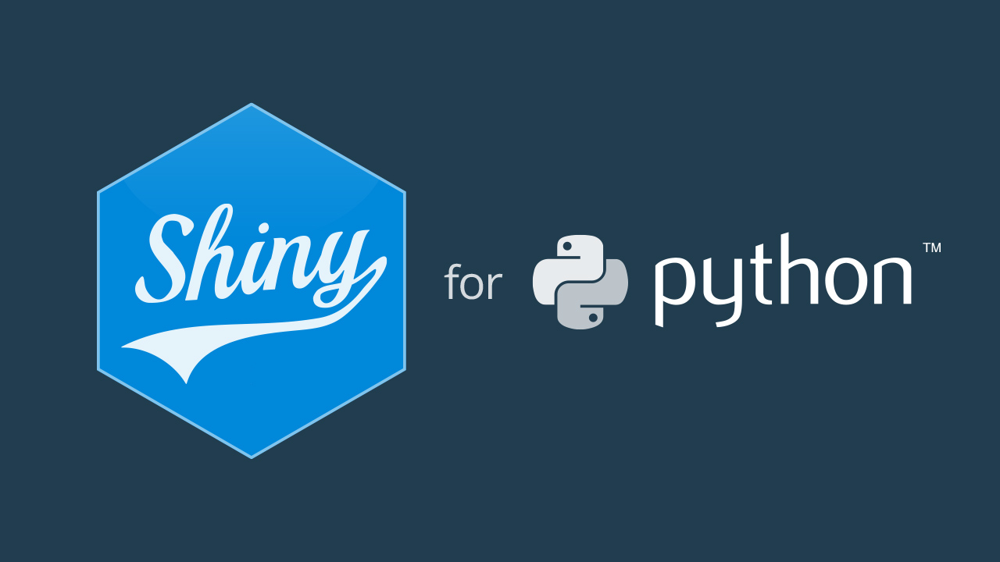

# Shiny Python Project
Python project built using the Shiny Framework

## Sales Dashboard Project

[Sales Dashboard Project](./sales)

This project walks through Shiny on how reactivity works, how to customize your application layout, combining Matplotlib, Plotly, Seaborn, and more in a single Python Dashboard and more. 
Lets see all these done using a given 12 months of sales data from an electronics store.

Screenshots below:-

### 1: 

### 2: 

### 3: 

### 4:

